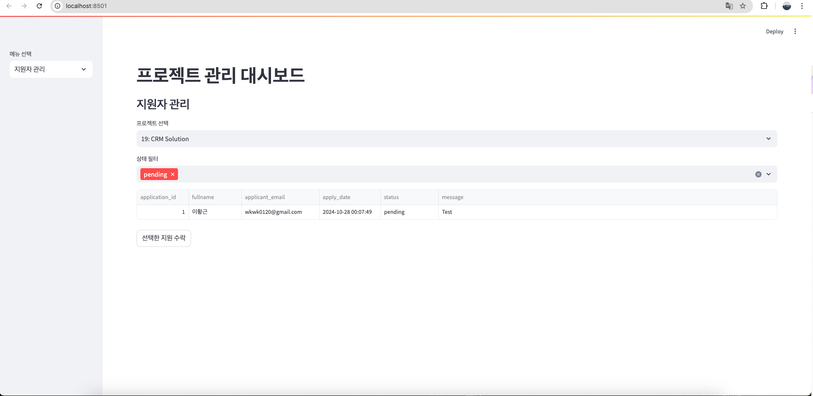

# Team Finder

- 프로젝트를 하고 싶어도 주변에 같이 할 팀원을 구하기 힘들 때 사용 가능한 어플리케이션입니다.
- Web, App, Software Project의 카테고리가 존재하고 각각 확인 가능합니다.
- 스크럼과 같이 자신의 힘든 점을 공유하고 서로 소통하며 해결할 수 있습니다.
- 팀원들을 구하기 위해 Project 공고를 Upload할 수 있습니다.
- **채팅**기능을 사용하여 다른 개발자와 연락을 가능하게 합니다

---

### A. 개발 팀원

- 이황근 ( 성균관대학교 소프트웨어학과 19학번 )

### B. 개발 환경

- OS: Android
- Language: Kotlin
- IDE: Android Studio JetPack Compose
- BackEnd Framework : Node.js
- Database : MySQL
- Target Device: Galaxy S10e

---

### C. 어플리케이션 소개

### TAB 1 - HOME

### features

- ***Find Your Project*** 에서 APP, WEB, Software 3종류로 필터링을 진행할 수 있습니다.
- 필터링 된 창에서는 그 기술을 기반으로 한 프로젝트를 보여줍니다.
- ***Recently Project List*** 에서는 현재 모집중인 프로젝트의 List를 볼 수 있습니다.
- 여기서 Apply 버튼을 누르게 되면 상세페이지로 넘어가게 됩니다.
- 상세페이지에서는 더 자세한 내용을 확인할 수 있습니다.

---

### 기술 설명

- Navigation Controller를 사용하여 화면 전환을 용이하게 하였습니다.
- Node.js에 Get요청을 하여 모든 프로젝트의 정보를 가져오고 MySQL의 WHERE 문을 이용하여 필터링을 진행하였습니다.

### TAB 2 - Feed

### features

- 상단에 있는 프로필을 눌러 채팅 채널로 이동할 수 있습니다.
- 피드를 확인할 수 있습니다.
- 피드 하단 바를 눌러 피드를 자세히 볼 수 있습니다.

---

### TAB 3 - Add

### features

- 프레임워크와 프로젝트 유형을 선택할 수 있습니다.
- 프로젝트명, 설명을 입력하고 프로젝트를 등록할 수 있습니다.

---

### TAB 4 - Chat

### features

- 채팅방을 눌러 채팅창으로 이동할 수 있습니다.
- 메시지 보내기, 공감, 답장 등의 기능을 이용할 수 있습니다.

- 의 Jetpack Compose Chat Messaging SDK를 이용하여 구현했습니다.
- -StreamChatInitializer 로 앱 시작시 채팅에 연결하여 로딩없이 채팅목록을 불러올 수 있습니다.

---

### BackOffice

- UI 구현
